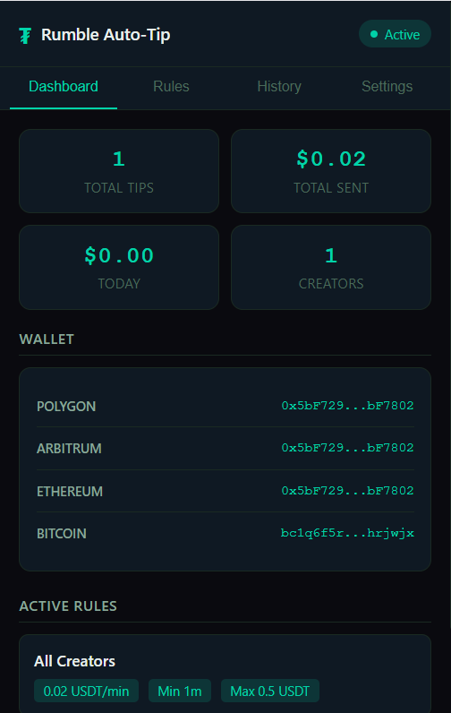
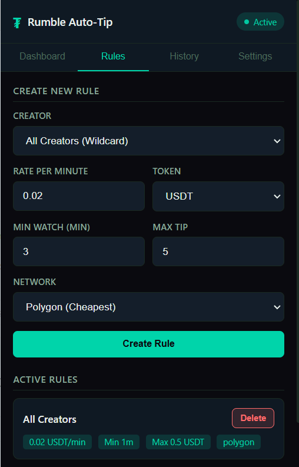
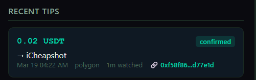
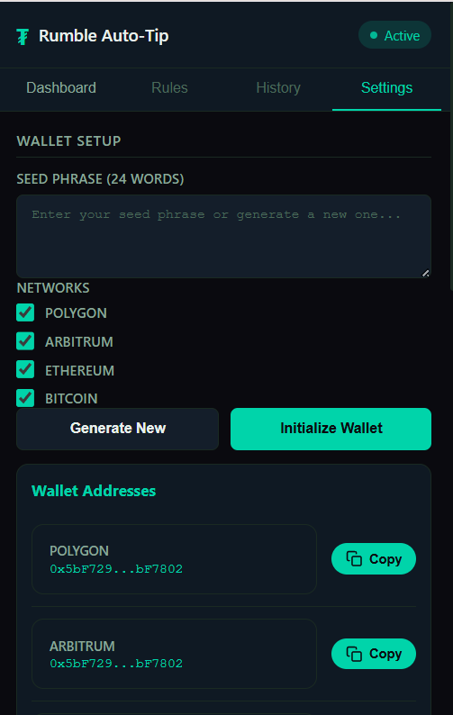

<div align="center">
<picture>
  
</picture>

# RumbleTipAI

<a href="#download--install"></a>
<a href="https://github.com/kalxe/rumble-extension/blob/main/rumble-autotip-extension/openclaw-skill/SKILL.md"></a>
<a href="#architecture"></a>
<a href="LICENSE"></a>

**AI-powered Chrome extension that autonomously tips Rumble creators in cryptocurrency.**<br/>
Watch videos. The agent decides. Tips land on-chain. Automatically.

Powered by **Tether WDK** &nbsp;|&nbsp; **GPT-4o-mini** &nbsp;|&nbsp; **Polygon, Ethereum, Arbitrum, Bitcoin**

</div>

---

<div align="center">

<br/><br/>


<br/><br/>

</div>

---

## Features

- 🤖 **AI-Powered Agent** — GPT-4o-mini reasons about every tipping decision with confidence scoring
- ⚡ **Autonomous Tipping** — watches videos and sends tips without manual intervention
- 💰 **Multi-Token** — USD₮, USA₮, XAU₮, BTC — the full Tether ecosystem
- 🌐 **Multi-Network** — Ethereum, Polygon, Arbitrum, Bitcoin
- 🔐 **Non-Custodial** — BIP-39 HD wallet via Tether WDK; you control the keys
- 📏 **Conditional Rules** — per-creator or wildcard; rate-per-minute, min watch time, max cap
- 💸 **Budget Guards** — daily spending limits, per-session caps, duplicate protection
- 🕵️ **Silent Wallet Detection** — extracts creator wallet via Rumble's HTMX endpoints invisibly
- 📊 **Real-Time Dashboard** — watch badge on videos, tip notifications, 4-tab popup UI
- 🧠 **OpenClaw Skill** — orchestrate the agent via the OpenClaw AI platform
- 🎨 **Dark Theme** — clean, modern interface that matches Rumble's aesthetic
- ⛽ **Optimized for Polygon** — micro-tips at ~$0.001 gas cost

---

## How It Works

```
You watch a Rumble video
      │
      ▼
Content Script detects video, creator, wallet address (silently via HTMX fetch)
      │
      │  WATCH_UPDATE every 30 seconds
      ▼
AI Agent evaluates:
  ✓ Rule match?  ✓ Minimum watch time?  ✓ Daily budget?
  ✓ LLM reasoning (confidence score + adjusted amount)
      │
      ▼
Tether WDK sends real on-chain tip
  → ERC-20 transfer on Polygon/Ethereum/Arbitrum
  → Or BTC transfer on Bitcoin
      │
      ▼
Creator receives tip in their Rumble Wallet
```

---

## Download & Install

### Prerequisites

- **Node.js** 18+
- **Chrome** browser
- OpenAI API key *(optional — for AI reasoning features)*

### Build from Source

```bash
git clone https://github.com/kalxe/rumble-extension.git
cd rumble-ai/rumble-autotip-extension
npm install
npm run build
```

### Load in Chrome

1. Open **`chrome://extensions`**
2. Enable **Developer mode** (top right toggle)
3. Click **Load unpacked**
4. Select the project root folder (that contains `manifest.json` and `dist/`)

### First-Time Setup

1. Click the extension icon → **Settings** tab
2. **Initialize wallet** — enter or generate a BIP-39 seed phrase
3. *(Optional)* Enter your OpenAI API key for AI-enhanced tipping
4. Go to **Rules** tab → create your first tipping rule
5. Visit **rumble.com** and start watching!

---

## AI Agent

The core innovation: an **autonomous AI agent** that goes beyond simple rule matching.

### Decision Pipeline

```
Step 1 │ Pre-checks         →  Already tipped this session? Valid video?
Step 2 │ Rule matching       →  Specific creator rule or wildcard match
Step 3 │ Amount calculation  →  watchMinutes × ratePerMinute (capped at max)
Step 4 │ Budget verification →  Daily limit check, per-session cap
Step 5 │ AI reasoning (LLM)  →  GPT-4o-mini contextual analysis
Step 6 │ Final decision      →  Confidence score ≥ threshold → proceed
Step 7 │ Execute payment     →  Tether WDK sends on-chain transaction
```

### LLM Context & Response

<details>
<summary><b>See example AI reasoning</b></summary>

```json
// Context sent to GPT-4o-mini:
{
  "creator": "iCheapshot",
  "watchTime": "5.2 minutes",
  "baseAmount": "$0.10 USDT",
  "rule": "$0.02/min, min 1 min, max $5.00",
  "todaySpending": "$2.30 / $50.00 daily limit",
  "recentTips": 4
}

// AI response:
{
  "shouldTip": true,
  "confidence": 0.92,
  "adjustedAmount": 0.10,
  "reasoning": "Good engagement at 5+ min. Within budget. Proceeding.",
  "sentiment": "positive"
}
```

</details>

The AI can **adjust amounts** and **veto low-confidence decisions** — but it **never exceeds** user-defined limits. If the API is unavailable, the agent gracefully falls back to pure rule-based logic.

### Agent Modes

| Mode | When | Behavior |
|------|------|----------|
| **AI-Enhanced** | OpenAI API key configured | LLM reasoning + rule engine |
| **Rule-Based** | No API key | Pure rule evaluation (always works) |
| **Manual** | Testing tab in popup | Instant test or live timer simulation |

---

## Wallet Integration

### Tether WDK — Real SDK, No Mocks

```
@tetherto/wdk-wallet-evm  →  WalletManagerEvm (Ethereum, Polygon, Arbitrum)
@tetherto/wdk-wallet-btc  →  WalletManagerBtc (Bitcoin via ElectrumWs)
```

- **Real** `WalletManagerEvm(seed, { provider })` → `account.transfer()` for ERC-20 tokens
- **Real** `WalletManagerBtc(seed, { client })` → `account.sendTransaction()` for BTC
- **Real** `account.getBalance()` / `account.getTokenBalance()` for live on-chain balances
- Browser-compatible sodium shim for memory-safe key management

### Supported Tokens & Networks

| Token | Symbol | Description | Networks |
|-------|--------|-------------|----------|
| **USD₮** | USDT | Tether USD | Ethereum, Polygon, Arbitrum |
| **USA₮** | USAT | Alloy Dollar | Ethereum |
| **XAU₮** | XAUT | Tether Gold | Ethereum |
| **BTC** | BTC | Bitcoin | Bitcoin |

### Network Gas Costs

| Network | Gas Fee | Best For |
|---------|---------|----------|
| **Polygon** | ~$0.001 | Micro-tips under $1 *(recommended)* |
| **Arbitrum** | ~$0.01 | Small tips $1–10 |
| **Ethereum** | ~$1–5 | Large tips over $10 |
| **Bitcoin** | Variable | BTC native tips |

---

## Architecture

```
                         ┌──────────────────────────┐
                         │     RUMBLE.COM PAGE       │
                         │  ┌────────────────────┐   │
                         │  │   Content Script    │   │
                         │  │  • Video detection  │   │
                         │  │  • Watch tracking   │   │
                         │  │  • HTMX wallet fetch│   │
                         │  │  • Tip badge UI     │   │
                         │  └─────────┬──────────┘   │
                         └────────────┼──────────────┘
                                      │ WATCH_UPDATE (30s)
                                      ▼
┌──────────────────────────────────────────────────────────────────┐
│                    SERVICE WORKER (background.js)                 │
│                                                                  │
│  ┌──────────────────┐  ┌───────────────┐  ┌──────────────────┐  │
│  │   AI AGENT        │  │    WALLET     │  │    STORAGE       │  │
│  │   (agent.js)      │  │  (wallet.js)  │  │  (storage.js)    │  │
│  │                   │  │               │  │                  │  │
│  │ • Rule Engine     │  │ • Tether WDK  │  │ • Chrome Storage │  │
│  │ • LLM Reasoning   │  │ • Multi-token │  │ • Watch sessions │  │
│  │ • Budget Guard    │  │ • Multi-chain │  │ • Tip history    │  │
│  │ • Decision Logger │  │ • ERC-20 xfer │  │ • Daily spending │  │
│  └──────────────────┘  └───────────────┘  └──────────────────┘  │
│                                                                  │
│  Pipeline: Pre-checks → Rules → Amount → Budget → AI → Pay      │
└──────────────────────────────────────────────────────────────────┘
                                      │
                                      ▼
                    ┌─────────────────────────────────┐
                    │          BLOCKCHAIN              │
                    │  Ethereum · Polygon · Arbitrum   │
                    │  Bitcoin                         │
                    │  USD₮ · USA₮ · XAU₮ · BTC       │
                    └─────────────────────────────────┘
```

---

## Project Structure

```
rumble-autotip-extension/
├── manifest.json              # Chrome Extension Manifest V3
├── package.json               # Dependencies (Tether WDK, ethers, polyfills)
├── webpack.config.js          # Build config with Node.js polyfills
├── LICENSE                    # Apache 2.0
│
├── src/
│   ├── background.js          # Service worker — agent orchestrator
│   ├── content.js             # Content script — Rumble.com integration
│   ├── agent.js               # AI-powered autonomous tipping agent
│   ├── wallet.js              # Tether WDK wallet integration
│   └── storage.js             # Chrome Storage API wrapper
│
├── popup/
│   ├── popup.html             # Extension popup (4-tab UI)
│   ├── popup.js               # Dashboard, rules, history, settings logic
│   └── popup.css              # Dark theme styling
│
├── openclaw-skill/
│   ├── skill.json             # OpenClaw skill metadata
│   └── SKILL.md               # AI agent orchestration instructions
│
├── img/                       # Screenshots for README
├── icons/                     # Extension icons (SVG + PNG)
└── dist/                      # Webpack output (load this in Chrome)
```

---

## Troubleshooting

<details>
<summary><b>See details</b></summary>

### Transaction fails with "Exceeded maximum fee cost"

The Tether WDK has a built-in gas fee limit. This has been resolved by removing the cap — Polygon fees are under $0.01.

### Wallet address is `null`

The extension silently fetches the creator's wallet via Rumble's HTMX endpoints. Make sure you are on a video page and the creator has a Rumble Wallet enabled. Check the Service Worker console for `[Content]` logs to trace the extraction flow.

### RPC errors (401 / timeout)

The extension uses free public RPCs. If one goes down, update the `RPC_PROVIDERS` object in `src/wallet.js`:

```javascript
const RPC_PROVIDERS = {
  ethereum: 'https://eth.drpc.org',
  polygon:  'https://polygon.drpc.org',
  arbitrum: 'https://arb1.arbitrum.io/rpc',
};
```

### Creator name has extra text ("Verified", follower counts)

Fixed — the extension now prioritizes JSON-LD structured data and uses regex cleanup to strip noise.

### **In any case, [open an issue](https://github.com/kalxe/rumble-extension/issues) and we'll help!**

</details>

---

## Hackathon Compliance

Built for the **Tether Hackathon Galactica: WDK Edition 1** (2026).

| Requirement | Status |
|-------------|--------|
| Uses WDK by Tether | ✅ `@tetherto/wdk`, `wdk-wallet-evm`, `wdk-wallet-btc` |
| Public GitHub repo | ✅ [github.com/kalxe/rumble-extension](https://github.com/kalxe/rumble-extension) |
| Apache 2.0 license | ✅ See [LICENSE](LICENSE) |
| Clear run/test instructions | ✅ This README + in-extension Testing tab |
| Agent architecture | ✅ AI-powered autonomous agent with LLM reasoning |
| Non-custodial wallet | ✅ User controls seed phrase, WDK manages keys |
| Multi-token support | ✅ USD₮, USA₮, XAU₮, BTC |
| Agentic payment design | ✅ Conditional, autonomous, programmable payments |
| Third-party disclosure | ✅ See below |

### Third-Party Dependencies

| Package | Purpose | License |
|---------|---------|---------|
| `@tetherto/wdk` | Tether Wallet Development Kit (core) | — |
| `@tetherto/wdk-wallet-evm` | EVM wallet manager | — |
| `@tetherto/wdk-wallet-btc` | Bitcoin wallet manager | — |
| `ethers` | Ethereum utilities | MIT |
| `webpack` | Module bundler | MIT |
| `buffer` / `crypto-browserify` / `stream-browserify` | Node.js polyfills | MIT |
| OpenAI API | LLM reasoning *(optional, user provides key)* | — |

### Judging Criteria

| Criteria | Our Implementation |
|----------|-------------------|
| **Agent Intelligence** | LLM-powered decision engine with confidence scoring, contextual analysis, graceful fallback |
| **WDK Integration** | Multi-token, multi-network, real ERC-20 transfers, non-custodial HD wallet |
| **Technical Execution** | Clean MV3 architecture, webpack polyfills, separated concerns, full error handling |
| **Agentic Payments** | Watch-time conditional payments, per-creator rules, daily budgets, autonomous execution |
| **Originality** | First AI agent that autonomously tips Rumble creators based on engagement |
| **Polish** | 4-tab popup UI, dark theme, tip notifications, TX explorer links, silent wallet detection |

---

## License

Licensed under the [Apache License, Version 2.0](LICENSE).

---

<div align="center">

**Powered by [Tether WDK](https://github.com/kalxe/rumble-extension) ₮**

*Built for the Tether Hackathon Galactica: WDK Edition 1 — 2026*

</div>
